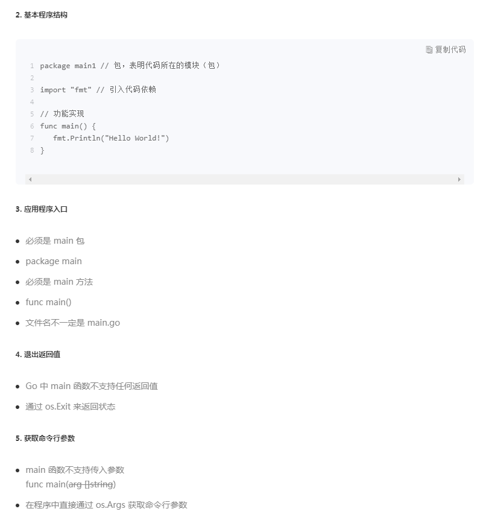
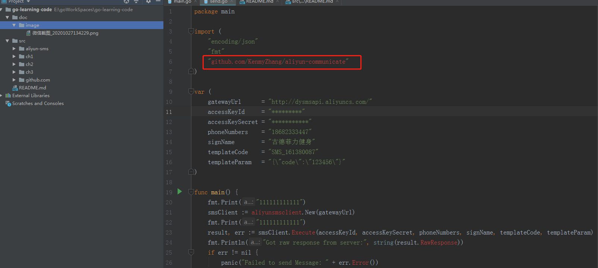

# 1.Go语言学习

## 1.1.程序基本结构

## 1.2.go引用外部包

# 2.问题
1.老师，像java做业务系统的时候，总有model,dao,service,controller,那么在go里面也是这么分吗如果go里面一个项目分多个目录（多个多级目录），
那package如何命名呢？

回答：你可以参考net/http：https://github.com/golang/go/tree/master/src/net/http

# 3.参考