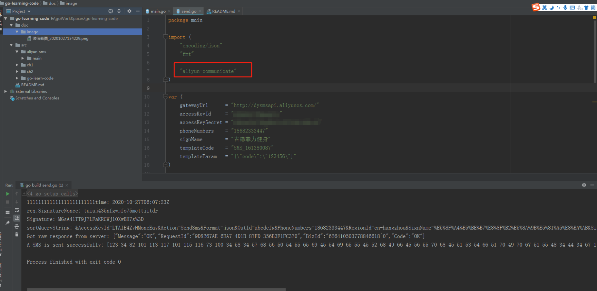

# 短信服务 Go语言开发 
采用的是阿里云-云通信-短信服务，原来的阿里大于品牌已经升级为“阿里云 · 云通信”。在阿里官方文档上只提供了java、php、python、nodejs的样例程序，没有提供go语言版本的，所以这里就补充一下用Go实现的样例程序，仅供参考

# 注意
升级为阿里云通讯后，所使用的签名算法也更新了，对于新入驻的用户来说，原来阿里大鱼那一套接口是用不了了，只有老用户才可以使用；新用户使用POP的签名算法，相对比较复杂

# 用途
用户注册、找回密码、用户身份验证、验证码登录等等

# 使用样例
## 参数说明
 	Access Key ID和Access Key Secret: 访问阿里云API的密钥,到阿里云帐号上创建
 	templateCode :短信模板ID，需要到阿里云帐号上申请，通过后会生成ID (模板示例："亲，你的验证码是${code},　不管有没有被打死，都不能告诉别人",模板ID："SMS_82045083")
 	templateParam :传入模板的参数(参数示例："{\"code\":\"1234\"}" )

## 手机收到短信如下所示
	[我的签名]你的验证码是1234,　不管有没有被打死，都不能告诉别人
  

## 程序
将其中的accessKeyId、accessKeySecret、phoneNumbers、signName、templateCode、templateParam替换成你的就可以直接使用了

```go
package main

import (
	"encoding/json"
	"fmt"

	"github.com/KenmyZhang/aliyun-communicate"
)

var (
	gatewayUrl      = "http://dysmsapi.aliyuncs.com/"
	accessKeyId     = "LTAIbTnPbawglLIQ"
	accessKeySecret = ""
	phoneNumbers    = "13544285**2"
	signName        = "坤Kenmy"
	templateCode    = "SMS_82045083"
	templateParam   = "{\"code\":\"1234\"}"
)

func main() {
	smsClient := aliyunsmsclient.New(gatewayUrl)
	result, err := smsClient.Execute(accessKeyId, accessKeySecret, phoneNumbers, signName, templateCode, templateParam)
	fmt.Println("Got raw response from server:", string(result.RawResponse))
	if err != nil {
		panic("Failed to send Message: " + err.Error())
	}

	resultJson, err := json.Marshal(result)
	if err != nil {
		panic(err)
	}
	if result.IsSuccessful() {
		fmt.Println("A SMS is sent successfully:", resultJson)
	} else {
		fmt.Println("Failed to send a SMS:", resultJson)
	}
}
```
## 总结

发送成功


## 参考http详解链接
https://help.aliyun.com/document_detail/56189.html?spm=5176.doc55288.6.567.O7dDSP


